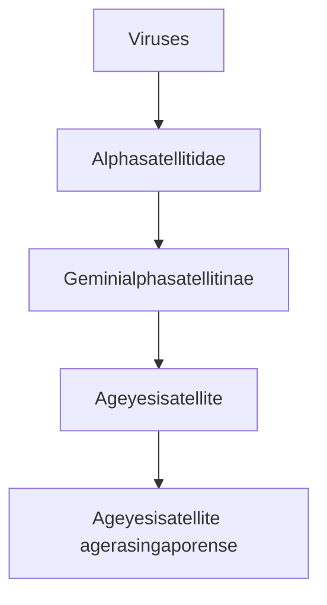

# Taxonomy

```mermaid
graph TD
    A["Viruses"] --> B["Alphasatellitidae"]
    B --> C["Geminialphasatellitinae"]
    C --> D["Ageyesisatellite"]
    D --> E["Ageyesisatellite agerasingaporense"]
``` 

    
    
